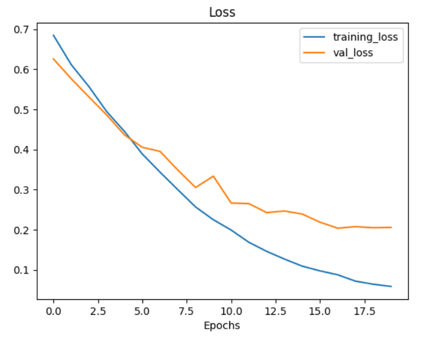
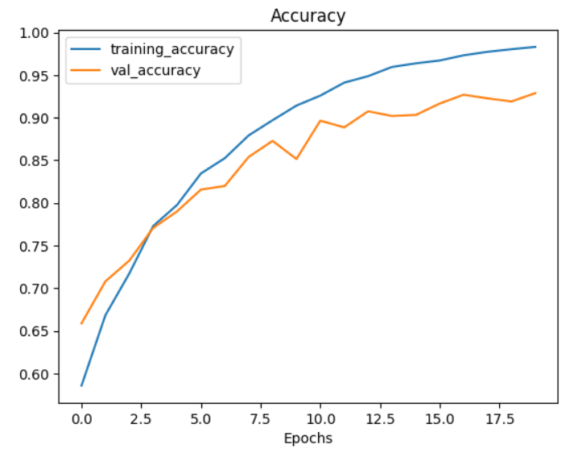
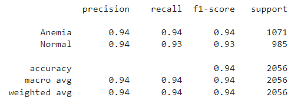

# anem.ai - Machine Learning 🤖
This repository contains code and files related to machine learning models for image classification using the MobileNet architecture. The model is drilled on a data set consisting of two classes: Anemic and Normal

## Machine Learning Roadmap

   

## Tools / Library / IDE
- Google Colaboratory
- Visual Studio Code
- TensorFlow
- Keras
- Scikit-learn
- Seaborn
- NumPy
- Matplotlib
- cv2
- Pandas

## Detection Model 
### Dataset
The dataset used for training and testing the model should be organized in the following directory structure:
This is a dataset containing conjunctiva images, consisting of 2 different classes. This dataset is used to train and test convolutional neural network models.

### Model Performance

   

   

   

## Chatbot Model 
### JSON
Lorem ipsum dolor sit amet, consectetur adipiscing elit. Nulla nec magna eros. Mauris sed eros augue. Phasellus et tortor eget diam posuere accumsan. Aenean at orci dui. Vestibulum ante ipsum, ornare quis lectus a, dapibus cursus risus. Vestibulum maximus sodales congue. Aliquam erat volutpat. Nam in aliquet risus. Duis vitae ex eget nisl consequat bibendum at facilisis orci. Vivamus finibus nibh iaculis velit tincidunt vehicula. Integer pretium suscipit nibh, at molestie nisl aliquam in. Donec lacinia at ligula a imperdiet. Sed orci neque, imperdiet ut tincidunt id, molestie id lorem. Phasellus porta dapibus enim eu facilisis. Donec congue est convallis dolor venenatis, a dignissim nisl faucibus.

### Output
Lorem ipsum dolor sit amet, consectetur adipiscing elit. Nulla nec magna eros. Mauris sed eros augue. Phasellus et tortor eget diam posuere accumsan. Aenean at orci dui. Vestibulum ante ipsum, ornare quis lectus a, dapibus cursus risus. Vestibulum maximus sodales congue. Aliquam erat volutpat. Nam in aliquet risus. Duis vitae ex eget nisl consequat bibendum at facilisis orci. Vivamus finibus nibh iaculis velit tincidunt vehicula. Integer pretium suscipit nibh, at molestie nisl aliquam in. Donec lacinia at ligula a imperdiet. Sed orci neque, imperdiet ut tincidunt id, molestie id lorem. Phasellus porta dapibus enim eu facilisis. Donec congue est convallis dolor venenatis, a dignissim nisl faucibus.

# How To Use
## Detection Model
1. User Takes a Picture of an eye, through the anem.ai app
2. User Selfie Will be sent to ML Model in the Cloud and converted into an array form
3. Retrieve data and the model makes predictions based on the eye conjunctiva detected in the image, and returns an image with the user's eye conjunctiva analysis

## Chatbot Model
1. Lorem ipsum dolor sit amet
2. Lorem ipsum dolor sit amet
3. Lorem ipsum dolor sit amet
